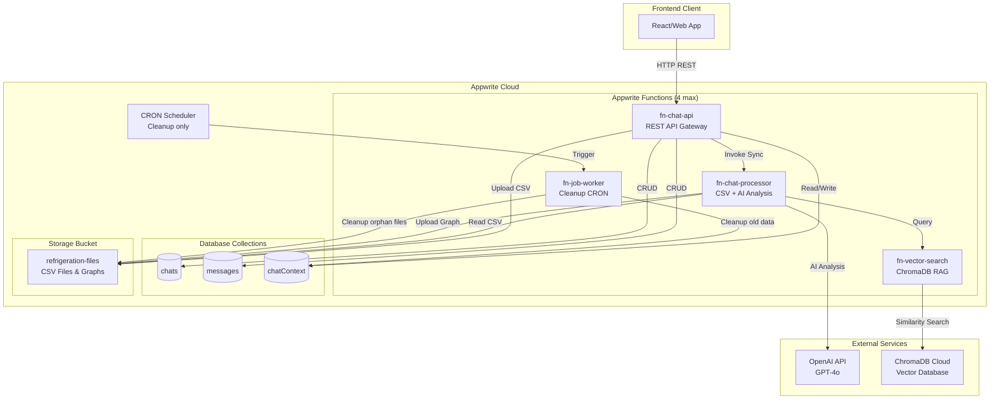
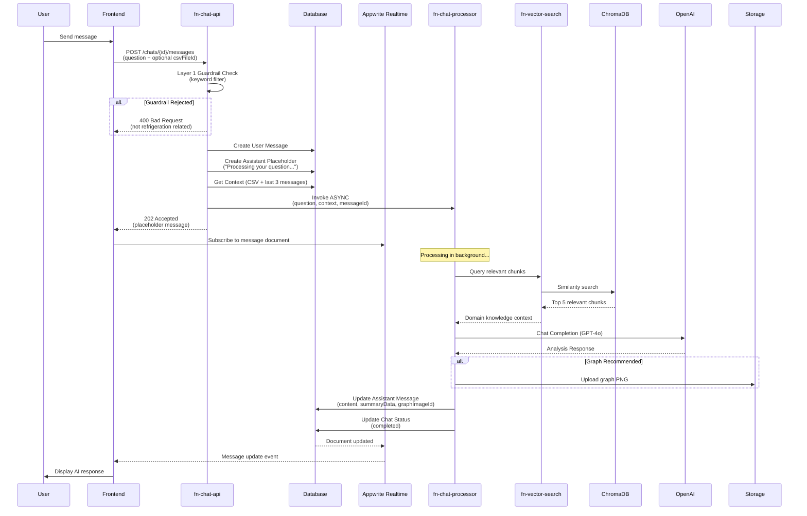
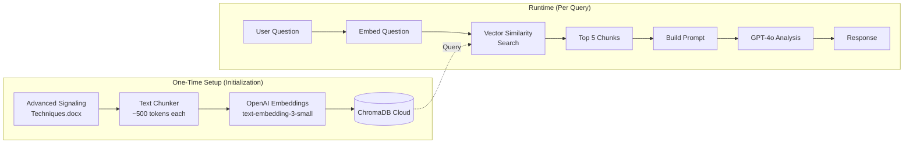
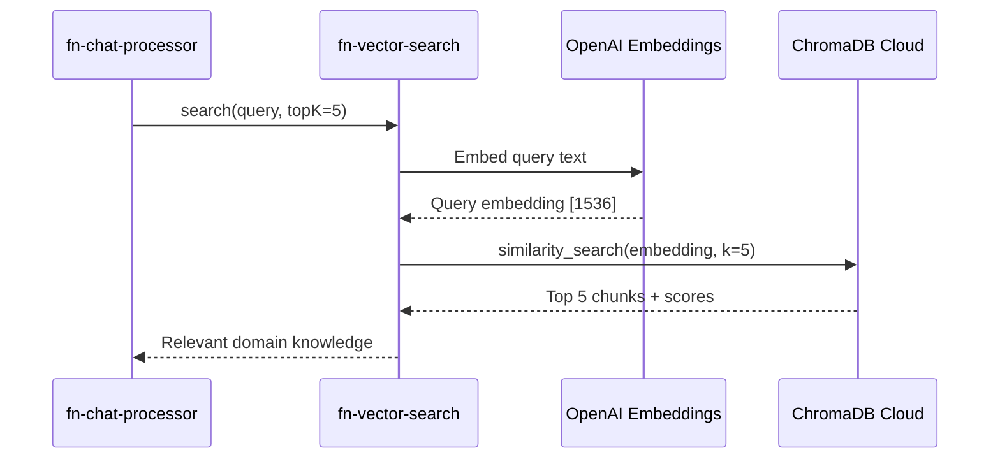

# IoT Refrigeration AI Chat - Architecture Documentation v3.0

> Comprehensive technical documentation for the IoT Refrigeration AI Chat system built on Appwrite Cloud with ChromaDB RAG and **asynchronous processing with Realtime subscriptions**.

## Table of Contents

- [1. System Overview](#1-system-overview)
- [2. Architecture Diagrams](#2-architecture-diagrams)
  - [2.1 High-Level Architecture](#21-high-level-architecture)
  - [2.2 Asynchronous Request Flow](#22-asynchronous-request-flow)
  - [2.3 RAG Pipeline Flow](#23-rag-pipeline-flow)
- [3. Function Documentation](#3-function-documentation)
  - [3.1 fn-chat-api](#31-fn-chat-api)
  - [3.2 fn-chat-processor](#32-fn-chat-processor)
  - [3.3 fn-vector-search](#33-fn-vector-search)
  - [3.4 fn-job-worker](#34-fn-job-worker)
- [4. ChromaDB RAG Integration](#4-chromadb-rag-integration)
- [5. Response Format Specification](#5-response-format-specification)
- [6. Graph Generation](#6-graph-generation)
- [7. Shared Library](#7-shared-library)
- [8. Database Schema](#8-database-schema)
- [9. Storage Configuration](#9-storage-configuration)
- [10. Security Architecture](#10-security-architecture)
- [11. Error Handling](#11-error-handling)
- [12. Environment Configuration](#12-environment-configuration)
- [13. Frontend Integration Guide](#13-frontend-integration-guide)

---

## 1. System Overview

The IoT Refrigeration AI Chat system is a serverless application built on **Appwrite Cloud** that enables users to upload refrigeration telemetry CSV data and receive AI-powered analysis using domain knowledge from the **Advanced Signaling Techniques Refrigeration Cases** document via RAG (Retrieval-Augmented Generation).

### Key Features

- **Asynchronous Chat**: Non-blocking API with Realtime subscriptions for updates
- **RAG-Powered Analysis**: ChromaDB vector search retrieves relevant domain knowledge
- **CSV Analysis**: Upload refrigeration telemetry data with automatic analysis
- **Smart Summaries**: Recommendations, datapoints, and graph generation
- **Continuous Chat**: Maintains conversation context (last 3 messages)
- **Security Guardrails**: Two-layer content filtering for refrigeration-only queries
- **No Timeout Issues**: Async execution avoids Appwrite free tier 15s limit

### Technology Stack

| Component | Technology |
|-----------|------------|
| Backend Platform | Appwrite Cloud (4 functions, 1 bucket) |
| Functions Runtime | Node.js 18 |
| Language | TypeScript |
| AI Provider | OpenAI GPT-4o |
| Vector Database | ChromaDB Cloud |
| Graph Library | Chart.js + chartjs-node-canvas |
| CSV Processing | csv-parse (streaming) |

### Design Principles

1. **Async with Realtime**: API returns immediately, frontend subscribes to DB updates
2. **RAG-First**: Use domain knowledge document before falling back to general OpenAI
3. **Context-Aware**: Maintain last 3 messages for continuous conversation
4. **Memory-Efficient**: Keep parsed CSV data in memory per chat session
5. **Timeout-Resilient**: Async execution handles long-running AI processing

---

## 2. Architecture Diagrams

### 2.1 High-Level Architecture



### 2.2 Asynchronous Request Flow



### 2.3 RAG Pipeline Flow



---

## 3. Function Documentation

### 3.1 fn-chat-api

**Purpose**: Primary REST API gateway with asynchronous processing orchestration

**Location**: `functions/fn-chat-api/`

**Key Responsibilities**:
- REST API endpoints for chat operations
- Layer 1 guardrails (keyword filtering)
- Layer 1 CSV guardrails (column validation)
- Chat context management (last 3 messages)
- Asynchronous invocation of fn-chat-processor (fire-and-forget)
- File upload handling
- Returns immediately with placeholder response

#### Endpoints

| Method | Path | Description | Response |
|--------|------|-------------|----------|
| `POST` | `/chats` | Create new chat session | Sync |
| `GET` | `/chats` | List user's chats | Sync |
| `GET` | `/chats/:chatId` | Get chat with messages | Sync |
| `DELETE` | `/chats/:chatId` | Delete chat + all resources | Sync |
| `POST` | `/chats/:chatId/messages` | Send message (main endpoint) | **Async (202)** |
| `GET` | `/chats/:chatId/messages` | List messages in chat | Sync |
| `POST` | `/upload` | Upload CSV file | Sync |

#### Main Endpoint: POST /chats/:chatId/messages

This is the primary endpoint that starts asynchronous message processing. It returns immediately with a placeholder response - the frontend should subscribe to Appwrite Realtime for updates.

**Request Body**:
```json
{
  "content": "Why is my case refrigerator showing temperature drift?",
  "csvFileId": "file_xyz789",
  "csvFileName": "cooling_data.csv",
  "csvFileSize": 2048576
}
```

**Response** (202 Accepted - Asynchronous):
```json
{
  "success": true,
  "data": {
    "userMessage": {
      "id": "msg_001",
      "chatId": "chat_abc123",
      "role": "user",
      "content": "Why is my case refrigerator showing temperature drift?",
      "createdAt": "2025-12-17T10:31:00.000Z"
    },
    "assistantMessage": {
      "id": "msg_002",
      "chatId": "chat_abc123",
      "role": "assistant",
      "content": "Processing your question...",
      "contentType": "text",
      "createdAt": "2025-12-17T10:31:00.000Z"
    },
    "status": "processing"
  }
}
```

> **Note**: The `assistantMessage` is a placeholder. Subscribe to Appwrite Realtime for the `messages` collection to receive the complete AI response when processing finishes.

#### File Structure

```
fn-chat-api/
├── src/
│   ├── main.ts                    # Entry point, CORS, routing
│   ├── types.ts                   # Request/response types
│   ├── handlers/
│   │   ├── chats.handler.ts       # Chat CRUD operations
│   │   ├── messages.handler.ts    # Message handling + processor invocation
│   │   └── upload.handler.ts      # File upload
│   ├── middleware/
│   │   └── guardrails.ts          # Layer 1 keyword guardrails
│   ├── services/
│   │   ├── context.service.ts     # Chat context management (last 3 msgs)
│   │   └── processor-invoker.ts   # Async invocation of fn-chat-processor (fire-and-forget)
│   └── utils/
│       └── response.ts            # Response helpers
├── package.json
└── tsconfig.json
```

#### Context Management

The API maintains conversation context by:
1. Fetching last 3 messages from the chat
2. Loading cached CSV data from `chatContext` collection (if available)
3. Passing context to fn-chat-processor

```typescript
interface ChatContext {
  chatId: string;
  lastMessages: Message[];      // Last 3 messages
  csvData?: ParsedCSVData;      // Cached parsed CSV
  csvFileId?: string;           // Reference to CSV file
  lastUpdated: Date;
}
```

---

### 3.2 fn-chat-processor

**Purpose**: Core processing engine for CSV analysis, RAG retrieval, and AI response generation. Updates database directly when processing completes.

**Location**: `functions/fn-chat-processor/`

**Trigger**: Asynchronous HTTP POST from fn-chat-api (fire-and-forget)

**Key Responsibilities**:
- CSV parsing with anomaly-preserving sampling
- Query fn-vector-search for domain knowledge
- Build AI prompt with RAG context
- Generate structured response (recommendations, datapoints)
- Generate graphs with edge case preservation
- Layer 2 semantic guardrails
- **Update message document in database when processing completes**
- **Update chat status to 'completed' or 'error'**

> **Important**: This function runs asynchronously and writes results directly to the database. The frontend receives updates via Appwrite Realtime subscriptions.

#### Actions

| Action | Description | Input | Output |
|--------|-------------|-------|--------|
| `process_message` | Full message processing | Question + context + CSV | Complete response |
| `generate_graph` | On-demand graph generation | Graph config + data | Graph image |

#### Action: process_message

**Request**:
```json
{
  "action": "process_message",
  "chatId": "chat_abc123",
  "userQuestion": "Why is my case refrigerator showing temperature drift?",
  "context": {
    "lastMessages": [
      {"role": "user", "content": "..."},
      {"role": "assistant", "content": "..."},
      {"role": "user", "content": "..."}
    ],
    "csvData": {
      "metadata": {...},
      "statistics": [...],
      "anomalies": [...]
    }
  },
  "csvFileId": "file_xyz789",
  "isFirstCSVMessage": true
}
```

**Response**:
```json
{
  "success": true,
  "data": {
    "content": "Based on analysis of your refrigeration data from Store #1234...",
    "summaryData": {
      "summary": "Temperature drift detected in case CASE-001 over 7-day period...",
      "recommendations": [
        {
          "id": "rec_001",
          "title": "Refrigerant Charge Check",
          "description": "The gradual temperature increase pattern suggests possible refrigerant undercharge. Schedule a refrigerant level check.",
          "priority": "high",
          "category": "maintenance",
          "actionLabel": "Check Now"
        },
        {
          "id": "rec_002",
          "title": "Evaporator Coil Inspection",
          "description": "Ice buildup on evaporator coil may be reducing heat transfer efficiency.",
          "priority": "high",
          "category": "maintenance",
          "actionLabel": "Schedule"
        },
        {
          "id": "rec_003",
          "title": "Verify Defrost Cycles",
          "description": "Review defrost cycle timing and duration to ensure adequate ice removal.",
          "priority": "medium",
          "category": "configuration",
          "actionLabel": "Review"
        }
      ],
      "datapoints": [
        {"label": "Air On Temperature", "value": "-16.2", "unit": "°C", "trend": "up"},
        {"label": "Discharge PWM", "value": "78", "unit": "%", "trend": "stable"},
        {"label": "Suction Pressure", "value": "42", "unit": "PSI", "trend": "down"},
        {"label": "High Pressure", "value": "285", "unit": "PSI", "trend": "up"},
        {"label": "Case Efficiency", "value": "82", "unit": "%", "trend": "down"},
        {"label": "Defrost Duration", "value": "25", "unit": "min", "trend": "up"},
        {"label": "Door Open Count", "value": "127", "unit": "today", "trend": "stable"},
        {"label": "Energy Usage", "value": "45.2", "unit": "kWh", "trend": "up"},
        {"label": "Compressor Cycles", "value": "48", "unit": "today", "trend": "up"},
        {"label": "Ambient Temperature", "value": "22.5", "unit": "°C", "trend": "stable"},
        {"label": "Product Temperature", "value": "-15.8", "unit": "°C", "trend": "up"}
      ],
      "graphConfig": {
        "type": "line",
        "title": "Air on Temperature Last 30 days",
        "xColumn": "timestamp",
        "yColumns": ["air_on_temperature"],
        "showAnomalies": true
      }
    },
    "graphImageId": "graph_abc123",
    "graphUrl": "https://cloud.appwrite.io/v1/storage/buckets/.../files/.../view",
    "parsedCSVData": {...},
    "ragChunksUsed": 5,
    "tokenUsage": {
      "promptTokens": 3500,
      "completionTokens": 1200,
      "totalTokens": 4700
    },
    "processingTime": 12500
  }
}
```

#### Processing Pipeline

```
┌─────────────────────────────────────────────────────────────────────┐
│                    PROCESS_MESSAGE PIPELINE                          │
├─────────────────────────────────────────────────────────────────────┤
│                                                                      │
│  1. GUARDRAIL CHECK (Layer 2 - Semantic)                            │
│     └─ Verify question is refrigeration-related                     │
│     └─ If rejected: Return suggestion message                       │
│                                                                      │
│  2. RAG RETRIEVAL                                                   │
│     └─ Call fn-vector-search with user question                     │
│     └─ Get top 5 relevant chunks from domain document               │
│                                                                      │
│  3. CSV PROCESSING (if csvFileId provided)                          │
│     └─ Download CSV from storage                                    │
│     └─ Parse with streaming (handle large files)                    │
│     └─ Extract metadata + statistics                                │
│     └─ Detect anomalies (Z-score > 3σ)                              │
│     └─ Cache parsed data for future messages                        │
│                                                                      │
│  4. PROMPT BUILDING                                                 │
│     └─ System prompt (refrigeration expert role)                    │
│     └─ Domain knowledge (RAG chunks)                                │
│     └─ CSV summary (if available)                                   │
│     └─ Last 3 messages (conversation context)                       │
│     └─ Current user question                                        │
│     └─ Response format instructions (JSON schema)                   │
│                                                                      │
│  5. AI ANALYSIS (GPT-4o)                                            │
│     └─ Call OpenAI with structured output                           │
│     └─ Parse response into recommendations + datapoints             │
│                                                                      │
│  6. GRAPH GENERATION (if CSV data available)                        │
│     └─ Sample data with anomaly preservation                        │
│     └─ Generate Chart.js configuration                              │
│     └─ Render to PNG                                                │
│     └─ Upload to storage                                            │
│                                                                      │
│  7. DATABASE UPDATE (Async Architecture)                            │
│     └─ Update message document with AI response content             │
│     └─ Store summaryData, graphImageId, processingTime              │
│     └─ Update chat status to 'completed' or 'error'                 │
│     └─ Triggers Appwrite Realtime notification to frontend          │
│                                                                      │
│  8. RESPONSE ASSEMBLY                                               │
│     └─ Combine all data into structured response                    │
│     └─ Return to fn-chat-api (for logging/tracking only)            │
│                                                                      │
└─────────────────────────────────────────────────────────────────────┘
```

#### File Structure

```
fn-chat-processor/
├── src/
│   ├── main.ts                        # Entry point
│   ├── types.ts                       # Types
│   ├── services/
│   │   ├── csv-processor.service.ts   # CSV parsing + statistics
│   │   ├── csv-sampler.service.ts     # Anomaly-preserving sampling
│   │   ├── rag.service.ts             # RAG retrieval orchestration
│   │   ├── openai.service.ts          # GPT-4o client
│   │   ├── prompt-builder.service.ts  # Prompt construction
│   │   ├── response-parser.service.ts # Parse AI response to structured
│   │   ├── graph-generator.service.ts # Chart.js rendering
│   │   └── guardrail.service.ts       # Layer 2 semantic check
│   └── prompts/
│       ├── system.prompt.ts           # System instructions
│       └── response-schema.ts         # JSON output schema
├── package.json
└── tsconfig.json
```

---

### 3.3 fn-vector-search

**Purpose**: RAG retrieval service using ChromaDB Cloud

**Location**: `functions/fn-vector-search/`

**Trigger**: Synchronous HTTP POST from fn-chat-processor

**Key Responsibilities**:
- Connect to ChromaDB Cloud
- Embed queries using OpenAI embeddings
- Perform similarity search
- Return relevant document chunks

#### Actions

| Action | Description | Input | Output |
|--------|-------------|-------|--------|
| `search` | Find relevant chunks | Query text | Top K chunks |
| `health` | Check ChromaDB connection | None | Status |

#### Action: search

**Request**:
```json
{
  "action": "search",
  "query": "Why is my case refrigerator showing temperature drift?",
  "topK": 5,
  "minScore": 0.7
}
```

**Response**:
```json
{
  "success": true,
  "data": {
    "chunks": [
      {
        "id": "chunk_042",
        "content": "## Residual Drift (baseline bias)\nFormulas: m_k = |mu_r| over window. T↑_warn=theta_warn...",
        "metadata": {
          "section": "Signal State Maps",
          "subsection": "Residual Drift",
          "pageNumber": 15
        },
        "score": 0.92
      },
      {
        "id": "chunk_018",
        "content": "### Dairy Case Envelope\nARMAX: ( T_t = αT_{t-1} + βD_t + ... )\nClear: ( T ∈ [2,4] °C...",
        "metadata": {
          "section": "Case Behavioral Envelopes",
          "subsection": "Dairy",
          "pageNumber": 8
        },
        "score": 0.88
      },
      // ... more chunks
    ],
    "totalChunks": 5,
    "queryEmbeddingTime": 45,
    "searchTime": 120
  }
}
```

#### ChromaDB Collection Schema

```typescript
interface DocumentChunk {
  id: string;                    // Unique chunk ID
  content: string;               // Text content (~500 tokens)
  embedding: number[];           // OpenAI embedding vector
  metadata: {
    section: string;             // Main section title
    subsection?: string;         // Subsection title
    pageNumber?: number;         // Original page reference
    documentName: string;        // Source document
    chunkIndex: number;          // Order in document
  };
}
```

#### File Structure

```
fn-vector-search/
├── src/
│   ├── main.ts                    # Entry point
│   ├── types.ts                   # Types
│   ├── services/
│   │   ├── chromadb.service.ts    # ChromaDB Cloud client
│   │   ├── embedding.service.ts   # OpenAI embeddings
│   │   └── search.service.ts      # Search orchestration
│   └── config/
│       └── chromadb.config.ts     # Connection settings
├── package.json
└── tsconfig.json
```

---

### 3.4 fn-job-worker

**Purpose**: CRON-triggered cleanup and maintenance tasks

**Location**: `functions/fn-job-worker/`

**Trigger**: Appwrite CRON (every 15 minutes)

**Key Responsibilities**:
- Clean up stale chat contexts (older than 24h)
- Remove orphaned files from storage
- Archive old chat data

#### Tasks

| Task | Frequency | Description |
|------|-----------|-------------|
| `cleanup_context` | Every 15 min | Remove stale chatContext entries |
| `cleanup_files` | Every hour | Remove orphaned graph images |
| `archive_chats` | Daily | Archive chats older than 30 days |

#### File Structure

```
fn-job-worker/
├── src/
│   ├── main.ts                    # Entry point
│   ├── tasks/
│   │   ├── cleanup-context.ts     # Context cleanup
│   │   ├── cleanup-files.ts       # Storage cleanup
│   │   └── archive-chats.ts       # Chat archival
│   └── utils/
│       └── scheduler.ts           # Task scheduling
├── package.json
└── tsconfig.json
```

---

## 4. ChromaDB RAG Integration

### 4.1 Document Preparation (One-Time Setup)

The **Advanced Signaling Techniques Refrigeration Cases.docx** document is processed once and stored in ChromaDB Cloud.

#### Chunking Strategy

```
Document (~15,000 words)
         │
         ▼
┌─────────────────────────────────────────────────────────────────────┐
│                      CHUNKING STRATEGY                               │
├─────────────────────────────────────────────────────────────────────┤
│                                                                      │
│  1. SECTION-BASED SPLITTING                                         │
│     └─ Split by main sections (## headers)                          │
│     └─ Keep subsections together when < 500 tokens                  │
│                                                                      │
│  2. SEMANTIC BOUNDARIES                                             │
│     └─ Split at paragraph boundaries                                │
│     └─ Never split mid-formula or mid-table                         │
│                                                                      │
│  3. OVERLAP                                                         │
│     └─ 50 token overlap between chunks                              │
│     └─ Preserves context at boundaries                              │
│                                                                      │
│  4. METADATA PRESERVATION                                           │
│     └─ Track section/subsection for each chunk                      │
│     └─ Store original page numbers                                  │
│                                                                      │
└─────────────────────────────────────────────────────────────────────┘
```

#### Chunk Examples

| Chunk ID | Section | Content Preview | Tokens |
|----------|---------|-----------------|--------|
| chunk_001 | Executive Summary | "Refrigeration cases in supermarkets..." | 450 |
| chunk_002 | ARMAX Modelling | "ARMAX = AutoRegressive Moving Average..." | 480 |
| chunk_003 | Sensor Requirements | "Category, Sensor/Digital Signal, Purpose..." | 420 |
| chunk_004 | Dairy Case Envelope | "ARMAX: ( T_t = αT_{t-1}... ), Clear: T ∈ [2,4]°C..." | 380 |
| chunk_005 | Frozen Case Envelope | "ARMAX: T_t includes mode... Clear: T ≤ -18°C..." | 350 |
| ... | ... | ... | ... |

#### Embedding Model

- **Model**: `text-embedding-3-small`
- **Dimensions**: 1536
- **Cost**: ~$0.00002 per 1K tokens

### 4.2 Runtime Query Flow



### 4.3 Fallback Strategy

```
┌─────────────────────────────────────────────────────────────────────┐
│                    RAG FALLBACK STRATEGY                             │
├─────────────────────────────────────────────────────────────────────┤
│                                                                      │
│  Question Received                                                   │
│         │                                                            │
│         ▼                                                            │
│  ┌─────────────────┐                                                │
│  │ Query ChromaDB  │                                                │
│  └────────┬────────┘                                                │
│           │                                                          │
│           ▼                                                          │
│  ┌─────────────────────────────────────────┐                        │
│  │ Check: Any chunks with score > 0.7?     │                        │
│  └────────┬───────────────────┬────────────┘                        │
│           │                   │                                      │
│          YES                  NO                                     │
│           │                   │                                      │
│           ▼                   ▼                                      │
│  ┌─────────────────┐  ┌─────────────────┐                           │
│  │ Use RAG chunks  │  │ General OpenAI  │                           │
│  │ in prompt       │  │ response        │                           │
│  └─────────────────┘  └─────────────────┘                           │
│                                                                      │
│  NOTE: If question has CSV data, always analyze CSV regardless      │
│        of RAG results. RAG provides domain context, not CSV         │
│        analysis.                                                     │
│                                                                      │
└─────────────────────────────────────────────────────────────────────┘
```

---

## 5. Response Format Specification

### 5.1 Summary Response Structure

Based on the UI mockup, the response includes four main components:

```typescript
interface AssistantResponse {
  // Main analysis text (markdown supported)
  content: string;

  // Structured summary data
  summaryData: {
    // Brief summary paragraph
    summary: string;

    // Action recommendations
    recommendations: Recommendation[];

    // Key metrics from CSV
    datapoints: Datapoint[];

    // Graph configuration (if applicable)
    graphConfig?: GraphConfig;
  };

  // Graph image (if generated)
  graphImageId?: string;
  graphUrl?: string;
}
```

### 5.2 Recommendations Format

```typescript
interface Recommendation {
  id: string;
  title: string;           // Short title (e.g., "Refrigerant Charge Check")
  description: string;     // Detailed explanation
  priority: 'high' | 'medium' | 'low';
  category: 'maintenance' | 'configuration' | 'monitoring' | 'immediate';
  actionLabel: string;     // Button text (e.g., "Check Now", "Schedule", "Review")
}
```

**Example**:
```json
{
  "id": "rec_001",
  "title": "Refrigerant Charge Check",
  "description": "The gradual temperature increase pattern over the past 7 days suggests possible refrigerant undercharge. This is indicated by rising suction superheat and decreasing cooling capacity. Schedule a refrigerant level check and leak inspection.",
  "priority": "high",
  "category": "maintenance",
  "actionLabel": "Check Now"
}
```

### 5.3 Datapoints Format

```typescript
interface Datapoint {
  label: string;           // Display name
  value: string;           // Current value
  unit: string;            // Unit of measurement
  trend: 'up' | 'down' | 'stable';  // Trend indicator
  status?: 'normal' | 'warning' | 'critical';  // Optional status
}
```

**Standard Datapoints** (when CSV contains relevant data):

| Label | Description | Unit |
|-------|-------------|------|
| Air On Temperature | Current air-on temp | °C |
| Discharge PWM | Compressor duty cycle | % |
| Suction Pressure | Low-side pressure | PSI |
| High Pressure | High-side pressure | PSI |
| Case Efficiency | Calculated efficiency | % |
| Defrost Duration | Average defrost time | min |
| Door Open Count | Daily door openings | count |
| Energy Usage | Daily energy consumption | kWh |
| Compressor Cycles | Daily cycle count | count |
| Ambient Temperature | Store ambient temp | °C |
| Product Temperature | Product probe temp | °C |

### 5.4 Graph Configuration

```typescript
interface GraphConfig {
  type: 'line' | 'bar' | 'scatter';
  title: string;
  xColumn: string;
  yColumns: string[];
  xLabel?: string;
  yLabel?: string;
  showAnomalies: boolean;   // Highlight anomaly points
  timeRange?: {
    start: string;
    end: string;
  };
}
```

---

## 6. Graph Generation

### 6.1 Anomaly-Preserving Downsampling

When CSV data exceeds the maximum data points (500), the system uses smart downsampling that preserves edge cases.

```
┌─────────────────────────────────────────────────────────────────────┐
│              ANOMALY-PRESERVING DOWNSAMPLING ALGORITHM              │
├─────────────────────────────────────────────────────────────────────┤
│                                                                      │
│  Input: 50,000 data points                                          │
│  Target: 500 data points                                            │
│                                                                      │
│  Step 1: RESERVE ANOMALY BUDGET (10%)                               │
│  ─────────────────────────────────────────                          │
│  • 450 points → Regular time-based sampling                         │
│  • 50 points  → Reserved for anomalies                              │
│                                                                      │
│  Step 2: TIME-BASED SAMPLING (90%)                                  │
│  ─────────────────────────────────────────                          │
│  • Divide time range into 450 equal buckets                         │
│  • Take one representative point per bucket                         │
│  • Ensures even temporal distribution                               │
│                                                                      │
│  Step 3: ANOMALY DETECTION                                          │
│  ─────────────────────────────────────────                          │
│  • Calculate Z-score for each numeric column                        │
│  • Flag points where |Z| > 3 (3σ rule)                              │
│  • Score each point by maximum Z-score across columns               │
│                                                                      │
│  Step 4: ADD ANOMALIES                                              │
│  ─────────────────────────────────────────                          │
│  • Sort anomalies by score (highest first)                          │
│  • Add top 50 anomalies not already in sample                       │
│  • Mark these points for visual highlighting                        │
│                                                                      │
│  Step 5: SORT BY TIMESTAMP                                          │
│  ─────────────────────────────────────────                          │
│  • Merge regular samples + anomalies                                │
│  • Sort by timestamp for proper graph rendering                     │
│                                                                      │
│  Output: 500 points with anomalies preserved                        │
│                                                                      │
└─────────────────────────────────────────────────────────────────────┘
```

### 6.2 Visual Example

```
Before Downsampling (10,000 points):
     ▲
  12 │                    ⚠️ SPIKE                    ⚠️ SPIKE
     │                    │                          │
   8 │    ╭───────────────┼──────────────────────────┼───────╮
     │   ╱                │                          │        ╲
   4 │──╱                 │                          │         ╲──
     │                    │                          │
   0 └────────────────────┴──────────────────────────┴───────────▶

After Smart Downsampling (500 points):
     ▲
  12 │                    ⚠️ PRESERVED               ⚠️ PRESERVED
     │                    │                          │
   8 │    •───•───•───•───┼──•───•───•───•───•───•──┼───•───•
     │   ╱                │                          │        ╲
   4 │──•                 │                          │         •──
     │                    │                          │
   0 └────────────────────┴──────────────────────────┴───────────▶
```

### 6.3 Graph Rendering

```typescript
// Chart.js configuration for temperature graph
const chartConfig: ChartConfiguration = {
  type: 'line',
  data: {
    labels: timestamps,
    datasets: [
      {
        label: 'Air On Temperature',
        data: values,
        borderColor: '#2563eb',
        backgroundColor: 'rgba(37, 99, 235, 0.1)',
        fill: true,
        tension: 0.1,
        pointRadius: (context) => {
          // Larger radius for anomaly points
          return context.raw.isAnomaly ? 6 : 2;
        },
        pointBackgroundColor: (context) => {
          // Red color for anomaly points
          return context.raw.isAnomaly ? '#dc2626' : '#2563eb';
        }
      }
    ]
  },
  options: {
    responsive: false,
    plugins: {
      title: { display: true, text: 'Air on Temperature Last 30 days' },
      legend: { display: true, position: 'bottom' },
      annotation: {
        annotations: anomalyAnnotations  // Highlight anomaly regions
      }
    },
    scales: {
      x: { title: { display: true, text: 'Date' } },
      y: { title: { display: true, text: 'Temperature (°C)' } }
    }
  }
};
```

### 6.4 Graph Generation Triggers

| Scenario | Auto Generate | On-Demand |
|----------|---------------|-----------|
| First message with CSV | Yes | Yes |
| Follow-up question (same CSV) | No | Yes |
| User asks "show graph" | - | Yes |
| User asks "temperature trends" | - | Yes |
| Question-only (no CSV) | No | No |

---

## 7. Shared Library

**Location**: `lib/`

### Structure

```
lib/
├── types/
│   ├── index.ts               # Re-exports all types
│   ├── chat.types.ts          # Chat, Context types
│   ├── message.types.ts       # Message, SummaryData, Recommendation
│   ├── csv.types.ts           # CSV parsing types
│   ├── rag.types.ts           # RAG chunk types
│   └── api.types.ts           # Request/Response types
├── constants/
│   ├── index.ts               # Re-exports all constants
│   ├── refrigeration.ts       # Keywords, columns, thresholds
│   └── errors.ts              # Error codes and messages
├── repositories/
│   ├── chat.repository.ts     # Chat data access
│   ├── message.repository.ts  # Message data access
│   └── context.repository.ts  # ChatContext data access
├── services/
│   └── guardrail.service.ts   # Layer 1 guardrails
└── utils/
    ├── db.ts                  # Appwrite client singleton
    └── errors.ts              # Custom error classes
```

### Key Types

```typescript
// Chat with context
interface Chat {
  $id: string;
  userId: string;
  title: string;
  status: 'active' | 'processing' | 'error';
  csvFileId?: string;
  csvFileName?: string;
  deviceType?: 'pack' | 'case' | 'mixed';
  createdAt: Date;
  updatedAt: Date;
}

// Message with summary
interface Message {
  $id: string;
  chatId: string;
  role: 'user' | 'assistant';
  content: string;
  contentType: 'text' | 'analysis' | 'error';
  summaryData?: SummaryData;
  graphImageId?: string;
  createdAt: Date;
}

// Summary data structure
interface SummaryData {
  summary: string;
  recommendations: Recommendation[];
  datapoints: Datapoint[];
  graphConfig?: GraphConfig;
}

// Chat context (for continuity)
interface ChatContext {
  chatId: string;
  csvData?: ParsedCSVData;
  csvFileId?: string;
  lastUpdated: Date;
  expiresAt: Date;  // Auto-cleanup after 24h
}
```

---

## 8. Database Schema

### Collections

#### chats

| Field | Type | Required | Description |
|-------|------|----------|-------------|
| `$id` | string | auto | Document ID |
| `$createdAt` | datetime | auto | Creation timestamp |
| `$updatedAt` | datetime | auto | Update timestamp |
| `userId` | string(36) | yes | Owner's Appwrite user ID |
| `title` | string(255) | yes | Display title |
| `status` | enum | yes | `active` \| `processing` \| `error` |
| `csvFileId` | string(36) | no | Reference to uploaded CSV |
| `csvFileName` | string(255) | no | Original filename |
| `deviceType` | enum | no | `pack` \| `case` \| `mixed` |
| `messageCount` | integer | yes | Total messages in chat |

**Indexes**:
- `userId_idx` on `userId`
- `userId_createdAt_idx` on `[userId, $createdAt]` (DESC)

#### messages

| Field | Type | Required | Description |
|-------|------|----------|-------------|
| `$id` | string | auto | Document ID |
| `$createdAt` | datetime | auto | Creation timestamp |
| `chatId` | string(36) | yes | Parent chat ID |
| `role` | enum | yes | `user` \| `assistant` |
| `content` | string(50000) | yes | Message text content |
| `contentType` | enum | yes | `text` \| `analysis` \| `error` |
| `summaryData` | string(100000) | no | JSON: SummaryData object |
| `graphImageId` | string(36) | no | Reference to graph image |
| `processingTime` | integer | no | Processing duration (ms) |

**Indexes**:
- `chatId_idx` on `chatId`
- `chatId_createdAt_idx` on `[chatId, $createdAt]` (DESC)

#### chatContext

| Field | Type | Required | Description |
|-------|------|----------|-------------|
| `$id` | string | auto | Document ID (same as chatId) |
| `chatId` | string(36) | yes | Associated chat |
| `csvData` | string(500000) | no | JSON: Parsed CSV data |
| `csvFileId` | string(36) | no | Reference to CSV file |
| `lastUpdated` | datetime | yes | Last update time |
| `expiresAt` | datetime | yes | Auto-cleanup time (24h) |

**Indexes**:
- `expiresAt_idx` on `expiresAt` (for cleanup queries)

---

## 9. Storage Configuration

### Bucket: refrigeration-files

| Setting | Value |
|---------|-------|
| Bucket ID | `refrigeration-files` |
| Max File Size | 50 MB |
| Allowed Extensions | `csv`, `png`, `jpg` |
| File Security | Enabled |
| Encryption | Enabled |

**Contents**:
- User-uploaded CSV files
- AI-generated graph images (PNG)

**Permissions**:
- Read: Authenticated users (own files only)
- Create: Authenticated users
- Delete: Authenticated users (own files only)

---

## 10. Security Architecture

### Two-Layer Guardrail System

```
┌─────────────────────────────────────────────────────────────────────┐
│                         USER REQUEST                                 │
└───────────────────────────────┬─────────────────────────────────────┘
                                │
                                ▼
┌─────────────────────────────────────────────────────────────────────┐
│                   LAYER 1: KEYWORD FILTER                            │
│  Location: fn-chat-api                                              │
│  Speed: <5ms | Cost: Free                                           │
├─────────────────────────────────────────────────────────────────────┤
│                                                                      │
│  BLOCKED PATTERNS (immediate reject):                               │
│  • Food recipes, cooking instructions                               │
│  • Weather forecasts                                                │
│  • Financial advice, stock prices                                   │
│  • General knowledge questions                                      │
│  • Code generation requests                                         │
│                                                                      │
│  REQUIRED PATTERNS (must match at least one):                       │
│  • Refrigeration keywords: refrigerator, freezer, cooler, case...  │
│  • Component keywords: compressor, evaporator, condenser...        │
│  • Measurement keywords: temperature, pressure, superheat...       │
│  • Issue keywords: alarm, drift, spike, icing, fault...            │
│                                                                      │
│  BYPASS CONDITIONS:                                                 │
│  • Has CSV file attached (assume refrigeration data)               │
│  • Generic analysis requests: "summarize", "analyze", "explain"    │
│                                                                      │
└───────────────────────────────┬─────────────────────────────────────┘
                                │
                    ┌───────────┴───────────┐
                    │                       │
                  PASS                   REJECT
                    │                       │
                    ▼                       ▼
┌─────────────────────────┐  ┌────────────────────────────────────────┐
│  Continue processing    │  │  Return 400 with suggestion:           │
└───────────────────────────┘  │  "I can help with refrigeration       │
                    │         │   questions. Try asking about          │
                    │         │   temperature, alarms, or maintenance."│
                    │         └────────────────────────────────────────┘
                    │
                    ▼
┌─────────────────────────────────────────────────────────────────────┐
│                   LAYER 2: SEMANTIC CHECK                            │
│  Location: fn-chat-processor                                        │
│  Speed: ~300ms | Cost: ~$0.0001                                     │
├─────────────────────────────────────────────────────────────────────┤
│                                                                      │
│  Model: GPT-4o-mini                                                 │
│  Task: Classify if question is refrigeration-related                │
│                                                                      │
│  CHECKS:                                                            │
│  • Topic relevance (is this about refrigeration equipment?)         │
│  • Prompt injection detection                                       │
│  • Role manipulation attempts                                       │
│                                                                      │
│  Confidence threshold: 0.7                                          │
│  Below threshold → Reject with suggestion                           │
│                                                                      │
└───────────────────────────────┬─────────────────────────────────────┘
                                │
                    ┌───────────┴───────────┐
                    │                       │
                  PASS                   REJECT
                    │                       │
                    ▼                       ▼
┌─────────────────────────┐  ┌────────────────────────────────────────┐
│  Proceed to AI analysis │  │  Return helpful rejection message      │
└─────────────────────────┘  └────────────────────────────────────────┘
```

### Input Sanitization

Patterns removed from user input:
- `ignore previous instructions`
- `disregard all previous`
- `you are now`
- `new instructions:`
- `system:` / `[SYSTEM]`
- `<|endoftext|>` and similar tokens

Maximum input length: 5,000 characters

---

## 11. Error Handling

### Error Response Format

```json
{
  "success": false,
  "error": {
    "code": "ERROR_CODE",
    "message": "Human-readable error message",
    "suggestion": "How to fix or what to try instead",
    "details": {}
  }
}
```

### Error Codes

| Code | HTTP | Description |
|------|------|-------------|
| `GUARDRAIL_REJECTED` | 400 | Question not refrigeration-related |
| `INVALID_CSV` | 400 | CSV format invalid |
| `CSV_TOO_LARGE` | 413 | CSV exceeds 50MB |
| `NOT_REFRIGERATION_DATA` | 400 | CSV missing refrigeration columns |
| `UNAUTHORIZED` | 401 | Missing authentication |
| `FORBIDDEN` | 403 | Access denied |
| `NOT_FOUND` | 404 | Resource not found |
| `OPENAI_ERROR` | 502 | OpenAI API error |
| `CHROMADB_ERROR` | 502 | ChromaDB connection error |
| `PROCESSING_TIMEOUT` | 504 | Request timeout (>60s) |

---

## 12. Environment Configuration

### Required Environment Variables

```bash
# Appwrite Configuration
APPWRITE_ENDPOINT=https://cloud.appwrite.io/v1
APPWRITE_PROJECT_ID=your-project-id
APPWRITE_API_KEY=your-api-key

# Database
DATABASE_ID=refrigeration-ai

# Storage
REFRIGERATION_BUCKET_ID=refrigeration-files

# OpenAI Configuration
OPENAI_API_KEY=sk-your-key
OPENAI_MODEL=gpt-4o
OPENAI_EMBEDDING_MODEL=text-embedding-3-small

# ChromaDB Cloud
CHROMADB_HOST=https://api.trychroma.com
CHROMADB_API_KEY=your-chromadb-key
CHROMADB_COLLECTION=refrigeration-knowledge

# Function IDs
FN_CHAT_PROCESSOR_ID=fn-chat-processor
FN_VECTOR_SEARCH_ID=fn-vector-search

# Processing Settings
MAX_CSV_SIZE_MB=50
MAX_GRAPH_DATA_POINTS=500
CONTEXT_MESSAGE_COUNT=3
CONTEXT_EXPIRY_HOURS=24
```

---

## 13. Frontend Integration Guide

### 13.1 Overview

The frontend integrates with the backend through an **asynchronous REST API with Realtime subscriptions**:

1. **Send Message**: POST returns immediately (HTTP 202) with a placeholder message
2. **Subscribe to Updates**: Use Appwrite Realtime to listen for message document changes
3. **Receive Complete Response**: When fn-chat-processor finishes, it updates the message in DB, triggering a Realtime event

This architecture avoids the 15-second timeout limit on Appwrite Cloud free tier.

### 13.2 Authentication

All API requests require Appwrite authentication headers:

```typescript
const headers = {
  'Content-Type': 'application/json',
  'X-Appwrite-Project': PROJECT_ID,
  'X-Appwrite-JWT': userSession.jwt  // From Appwrite auth
};
```

### 13.3 API Integration

#### Create Chat Session

```typescript
// POST /chats
const createChat = async (): Promise<Chat> => {
  const response = await fetch(`${API_URL}/chats`, {
    method: 'POST',
    headers,
    body: JSON.stringify({ title: 'New Analysis' })
  });
  return response.json();
};
```

#### Upload CSV File

```typescript
// POST /upload
const uploadCSV = async (file: File): Promise<{ fileId: string }> => {
  const formData = new FormData();
  formData.append('file', file);

  const response = await fetch(`${API_URL}/upload`, {
    method: 'POST',
    headers: { 'X-Appwrite-JWT': jwt },
    body: formData
  });
  return response.json();
};
```

#### Send Message (Main Endpoint - Async)

```typescript
// POST /chats/:chatId/messages
interface SendMessageRequest {
  content: string;
  csvFileId?: string;
  csvFileName?: string;
  csvFileSize?: number;
}

interface SendMessageResponse {
  success: boolean;
  data: {
    userMessage: Message;
    assistantMessage: AssistantMessage;  // Placeholder with "Processing..."
    status: 'processing';
  };
}

const sendMessage = async (
  chatId: string,
  request: SendMessageRequest
): Promise<SendMessageResponse> => {
  const response = await fetch(`${API_URL}/chats/${chatId}/messages`, {
    method: 'POST',
    headers,
    body: JSON.stringify(request)
  });
  // Returns HTTP 202 Accepted with placeholder
  return response.json();
};
```

### 13.4 Realtime Subscription (Required)

After sending a message, subscribe to Realtime updates to receive the complete AI response:

```typescript
import { Client } from 'appwrite';

const client = new Client()
  .setEndpoint('https://fra.cloud.appwrite.io/v1')
  .setProject(PROJECT_ID);

/**
 * Subscribe to message updates for real-time AI responses
 */
const subscribeToMessage = (
  messageId: string,
  onUpdate: (message: AssistantMessage) => void
): () => void => {
  const channel = `databases.${DATABASE_ID}.collections.messages.documents.${messageId}`;

  const unsubscribe = client.subscribe(channel, (response) => {
    if (response.events.includes('databases.*.collections.*.documents.*.update')) {
      const updatedMessage = response.payload as AssistantMessage;

      // Check if processing is complete
      const isComplete = updatedMessage.content !== 'Processing your question...' &&
                        updatedMessage.content !== 'Analyzing your refrigeration data...';

      if (isComplete) {
        onUpdate(updatedMessage);
        unsubscribe();  // Clean up subscription
      }
    }
  });

  return unsubscribe;
};

/**
 * Complete send message flow with Realtime subscription
 */
const sendMessageWithRealtime = async (
  chatId: string,
  content: string,
  csvFileId?: string
) => {
  // 1. Send message (returns immediately with placeholder)
  const response = await sendMessage(chatId, { content, csvFileId });
  const { userMessage, assistantMessage } = response.data;

  // 2. Add messages to UI immediately
  addMessageToChat(userMessage);
  addMessageToChat(assistantMessage);  // Shows "Processing..."

  // 3. Subscribe to updates for the assistant message
  const unsubscribe = subscribeToMessage(assistantMessage.id, (updated) => {
    // 4. Update UI with complete response
    updateMessageInChat(updated);
  });

  // 5. Return cleanup function for component unmount
  return unsubscribe;
};
```

### 13.5 React Hook Example

```typescript
import { useEffect, useRef, useCallback } from 'react';
import { Client } from 'appwrite';

const useMessageRealtime = (databaseId: string, projectId: string) => {
  const clientRef = useRef<Client | null>(null);
  const unsubscribeRef = useRef<(() => void) | null>(null);

  useEffect(() => {
    clientRef.current = new Client()
      .setEndpoint('https://fra.cloud.appwrite.io/v1')
      .setProject(projectId);

    return () => {
      if (unsubscribeRef.current) {
        unsubscribeRef.current();
      }
    };
  }, [projectId]);

  const subscribeToMessage = useCallback((
    messageId: string,
    onComplete: (message: AssistantMessage) => void,
    onError?: (error: Error) => void
  ) => {
    if (!clientRef.current) return;

    // Clean up previous subscription
    if (unsubscribeRef.current) {
      unsubscribeRef.current();
    }

    const channel = `databases.${databaseId}.collections.messages.documents.${messageId}`;

    unsubscribeRef.current = clientRef.current.subscribe(channel, (response) => {
      const message = response.payload as AssistantMessage;

      // Check for error response
      if (message.contentType === 'error') {
        onError?.(new Error(message.content));
        unsubscribeRef.current?.();
        return;
      }

      // Check if processing is complete
      const isProcessing = message.content === 'Processing your question...' ||
                          message.content === 'Analyzing your refrigeration data...';

      if (!isProcessing) {
        onComplete(message);
        unsubscribeRef.current?.();
      }
    });

    return unsubscribeRef.current;
  }, [databaseId]);

  return { subscribeToMessage };
};
```

### 13.6 Response Handling

#### TypeScript Interfaces

```typescript
interface AssistantMessage {
  id: string;
  chatId: string;
  role: 'assistant';
  content: string;           // Main analysis text (markdown)
  contentType: 'analysis' | 'text' | 'error';
  summaryData?: SummaryData;
  graphImageId?: string;
  graphUrl?: string;
  createdAt: string;
}

interface SummaryData {
  summary: string;
  recommendations: Recommendation[];
  datapoints: Datapoint[];
  graphConfig?: GraphConfig;
}

interface Recommendation {
  id: string;
  title: string;
  description: string;
  priority: 'high' | 'medium' | 'low';
  category: 'maintenance' | 'configuration' | 'monitoring' | 'immediate';
  actionLabel: string;
}

interface Datapoint {
  label: string;
  value: string;
  unit: string;
  trend: 'up' | 'down' | 'stable';
  status?: 'normal' | 'warning' | 'critical';
}
```

### 13.7 UI Component Mapping

```
┌─────────────────────────────────────────────────────────────────────┐
│                        CHAT MESSAGE UI                               │
├─────────────────────────────────────────────────────────────────────┤
│                                                                      │
│  ┌─────────────────────────────────────────────────────────────┐    │
│  │  RECOMMENDATIONS SECTION                                     │    │
│  │  ─────────────────────────────────────────────────────────  │    │
│  │  Map: summaryData.recommendations[]                         │    │
│  │                                                              │    │
│  │  ┌──────────────────────────────────────────────────────┐   │    │
│  │  │ [HIGH] Refrigerant Charge Check          [Check Now] │   │    │
│  │  │ The gradual temperature increase pattern...          │   │    │
│  │  └──────────────────────────────────────────────────────┘   │    │
│  │                                                              │    │
│  │  ┌──────────────────────────────────────────────────────┐   │    │
│  │  │ [HIGH] Evaporator Coil Inspection        [Schedule]  │   │    │
│  │  │ Ice buildup on evaporator coil may be...             │   │    │
│  │  └──────────────────────────────────────────────────────┘   │    │
│  │                                                              │    │
│  │  ┌──────────────────────────────────────────────────────┐   │    │
│  │  │ [MEDIUM] Verify Defrost Cycles           [Review]    │   │    │
│  │  │ Review defrost cycle timing and duration...          │   │    │
│  │  └──────────────────────────────────────────────────────┘   │    │
│  └─────────────────────────────────────────────────────────────┘    │
│                                                                      │
│  ┌─────────────────────────────────────────────────────────────┐    │
│  │  SUMMARY TEXT                                                │    │
│  │  ─────────────────────────────────────────────────────────  │    │
│  │  Render: summaryData.summary (or content as markdown)       │    │
│  │                                                              │    │
│  │  "Temperature drift detected in case CASE-001 over 7-day    │    │
│  │   period, indicating potential evaporator coil icing or     │    │
│  │   refrigerant undercharge..."                               │    │
│  └─────────────────────────────────────────────────────────────┘    │
│                                                                      │
│  ┌─────────────────────────────────────────────────────────────┐    │
│  │  GRAPH                                                       │    │
│  │  ─────────────────────────────────────────────────────────  │    │
│  │  Source: graphUrl                                           │    │
│  │                                                              │    │
│  │  ┌──────────────────────────────────────────────────────┐   │    │
│  │  │        Air on Temperature Last 30 days               │   │    │
│  │  │   ▲                                                   │   │    │
│  │  │   │    ╭─╮                          ╭─╮              │   │    │
│  │  │   │   ╱   ╲    ╭─╮    ╭─╮    ╭─╮   ╱   ╲   ╭─╮       │   │    │
│  │  │   │──╱─────╲──╱───╲──╱───╲──╱───╲─╱─────╲─╱───╲──    │   │    │
│  │  │   └────────────────────────────────────────────▶     │   │    │
│  │  └──────────────────────────────────────────────────────┘   │    │
│  │  [Download] [View Full Screen]                              │    │
│  └─────────────────────────────────────────────────────────────┘    │
│                                                                      │
│  ┌─────────────────────────────────────────────────────────────┐    │
│  │  DATAPOINTS TABLE                                            │    │
│  │  ─────────────────────────────────────────────────────────  │    │
│  │  Map: summaryData.datapoints[]                              │    │
│  │                                                              │    │
│  │  ┌────────────────────┬─────────────┬──────────────────┐   │    │
│  │  │ Metric             │ Value       │ Trend            │   │    │
│  │  ├────────────────────┼─────────────┼──────────────────┤   │    │
│  │  │ Air On Temperature │ -16.2 °C    │ ▲ (up)          │   │    │
│  │  │ Discharge PWM      │ 78 %        │ ─ (stable)      │   │    │
│  │  │ Suction Pressure   │ 42 PSI      │ ▼ (down)        │   │    │
│  │  │ High Pressure      │ 285 PSI     │ ▲ (up)          │   │    │
│  │  │ Case Efficiency    │ 82 %        │ ▼ (down)        │   │    │
│  │  │ Defrost Duration   │ 25 min      │ ▲ (up)          │   │    │
│  │  │ Door Open Count    │ 127 today   │ ─ (stable)      │   │    │
│  │  │ Energy Usage       │ 45.2 kWh    │ ▲ (up)          │   │    │
│  │  │ Compressor Cycles  │ 48 today    │ ▲ (up)          │   │    │
│  │  │ Ambient Temp       │ 22.5 °C     │ ─ (stable)      │   │    │
│  │  │ Product Temp       │ -15.8 °C    │ ▲ (up)          │   │    │
│  │  └────────────────────┴─────────────┴──────────────────┘   │    │
│  └─────────────────────────────────────────────────────────────┘    │
│                                                                      │
└─────────────────────────────────────────────────────────────────────┘
```

### 13.8 React Component Example

```tsx
// ChatMessage.tsx
import React from 'react';
import { AssistantMessage } from './types';
import { RecommendationCard } from './RecommendationCard';
import { DatapointsTable } from './DatapointsTable';
import { MarkdownRenderer } from './MarkdownRenderer';
import { Spinner } from './Spinner';

interface Props {
  message: AssistantMessage;
}

export const ChatMessage: React.FC<Props> = ({ message }) => {
  const { summaryData, graphUrl, content, contentType } = message;

  // Check if message is still processing
  const isProcessing = content === 'Processing your question...' ||
                       content === 'Analyzing your refrigeration data...';

  // Handle processing state
  if (isProcessing) {
    return (
      <div className="assistant-message processing">
        <Spinner />
        <span>{content}</span>
      </div>
    );
  }

  // Handle error state
  if (contentType === 'error') {
    return (
      <div className="assistant-message error">
        <span className="error-icon">⚠️</span>
        <span>{content}</span>
      </div>
    );
  }

  return (
    <div className="assistant-message">
      {/* Recommendations */}
      {summaryData?.recommendations && summaryData.recommendations.length > 0 && (
        <section className="recommendations">
          <h3>Recommendations</h3>
          {summaryData.recommendations.map(rec => (
            <RecommendationCard key={rec.id} recommendation={rec} />
          ))}
        </section>
      )}

      {/* Summary Text */}
      {summaryData?.summary && (
        <section className="summary">
          <MarkdownRenderer content={summaryData.summary} />
        </section>
      )}

      {/* Graph */}
      {graphUrl && (
        <section className="graph">
          
        </section>
      )}

      {/* Datapoints Table */}
      {summaryData?.datapoints && summaryData.datapoints.length > 0 && (
        <section className="datapoints">
          <h3>Datapoints</h3>
          <DatapointsTable datapoints={summaryData.datapoints} />
        </section>
      )}
    </div>
  );
};
```

### 13.9 Error Handling

```tsx
const sendMessage = async (chatId: string, content: string, csvFileId?: string) => {
  try {
    const response = await api.sendMessage(chatId, { content, csvFileId });

    if (!response.success) {
      // Handle known errors
      switch (response.error.code) {
        case 'GUARDRAIL_REJECTED':
          showToast({
            type: 'warning',
            title: 'Topic Not Supported',
            message: response.error.suggestion
          });
          break;
        case 'INVALID_CSV':
          showToast({
            type: 'error',
            title: 'Invalid CSV File',
            message: 'Please upload a valid refrigeration data CSV file.'
          });
          break;
        default:
          showToast({
            type: 'error',
            title: 'Error',
            message: response.error.message
          });
      }
      return;
    }

    // Add messages to chat
    addMessage(response.data.userMessage);
    addMessage(response.data.assistantMessage);

  } catch (error) {
    showToast({
      type: 'error',
      title: 'Connection Error',
      message: 'Unable to connect to the server. Please try again.'
    });
  }
};
```

### 13.10 Chat History Loading

```typescript
// Load chat list
const loadChats = async (): Promise<Chat[]> => {
  const response = await fetch(`${API_URL}/chats?limit=20`, { headers });
  const data = await response.json();
  return data.data.chats;
};

// Load single chat with messages
const loadChat = async (chatId: string): Promise<ChatWithMessages> => {
  const response = await fetch(`${API_URL}/chats/${chatId}`, { headers });
  return response.json();
};
```

### 13.11 File Upload with Progress

```typescript
const uploadCSVWithProgress = async (
  file: File,
  onProgress: (percent: number) => void
): Promise<{ fileId: string }> => {
  return new Promise((resolve, reject) => {
    const xhr = new XMLHttpRequest();

    xhr.upload.addEventListener('progress', (e) => {
      if (e.lengthComputable) {
        onProgress(Math.round((e.loaded / e.total) * 100));
      }
    });

    xhr.addEventListener('load', () => {
      if (xhr.status === 200) {
        resolve(JSON.parse(xhr.responseText));
      } else {
        reject(new Error('Upload failed'));
      }
    });

    xhr.addEventListener('error', () => reject(new Error('Upload failed')));

    const formData = new FormData();
    formData.append('file', file);

    xhr.open('POST', `${API_URL}/upload`);
    xhr.setRequestHeader('X-Appwrite-JWT', jwt);
    xhr.send(formData);
  });
};
```

---

## Appendix: Quick Reference

### API Endpoint Summary

```
POST   /chats                    Create chat
GET    /chats                    List chats
GET    /chats/:id                Get chat with messages
DELETE /chats/:id                Delete chat
POST   /chats/:id/messages       Send message (MAIN ENDPOINT)
GET    /chats/:id/messages       List messages
POST   /upload                   Upload CSV file
```

### Function Invocation Matrix

| Caller | Calls | Method |
|--------|-------|--------|
| fn-chat-api | fn-chat-processor | **Async HTTP (fire-and-forget)** |
| fn-chat-processor | fn-vector-search | Sync HTTP |
| fn-chat-processor | OpenAI | Sync HTTP |
| fn-chat-processor | Database | Sync HTTP (writes results) |
| fn-vector-search | ChromaDB Cloud | Sync HTTP |
| fn-job-worker | (cleanup only) | - |

### Data Flow Summary (Async Architecture)

```
User → fn-chat-api → Database (placeholder)
                  │
                  └─→ fn-chat-processor (ASYNC) → fn-vector-search → ChromaDB
                                             │
                                             └─→ OpenAI (GPT-4o)
                                             │
                                             └─→ Storage (graphs)
                                             │
                                             └─→ Database (final results)
                                                        │
                                                        └─→ Realtime event
                                                               │
User ← fn-chat-api ← 202 Accepted (placeholder)               │
                                                               │
User ← Appwrite Realtime ←─────────────────────────────────────┘
       (complete response)
```

### Response Time Expectations

| Scenario | API Response | Complete Response (via Realtime) |
|----------|--------------|----------------------------------|
| Any message | **< 1 second** (202 Accepted) | Varies by processing |
| Text-only question (with RAG) | < 1 second | 5-10 seconds |
| Question + existing CSV | < 1 second | 10-20 seconds |
| Question + new CSV upload | < 1 second | 15-30 seconds |
| Graph generation (on-demand) | < 1 second | 5-10 seconds |

> **Note**: The API always responds immediately with a placeholder. The "Complete Response" time indicates when the Realtime subscription will deliver the final AI response. This architecture ensures no timeout issues on Appwrite Cloud free tier (15s limit).

---

*Documentation Version: 3.0.0*
*Last Updated: December 2025*
*Architecture: Async with Realtime Subscriptions*
